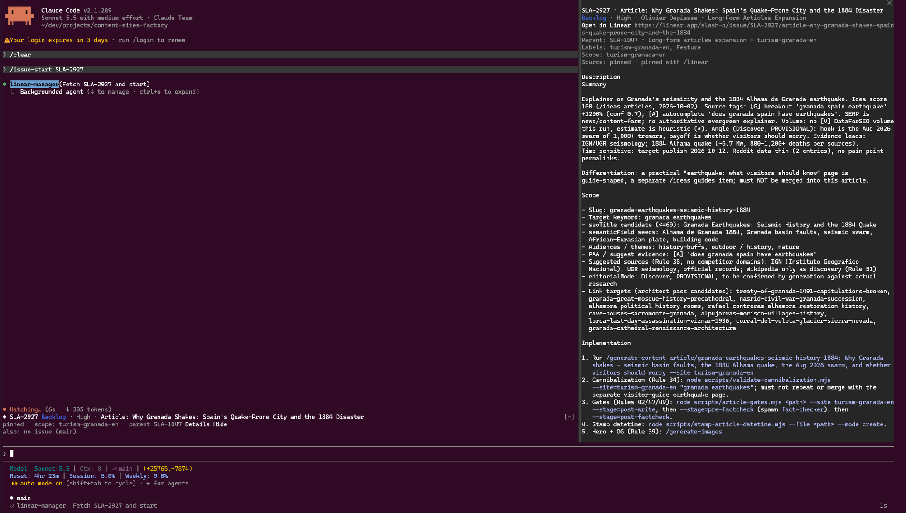

# Linear Workflow

Work Linear issues from Claude Code, from picking the next issue in the cycle to the merged PR.
Linear stays up to date along the way, and the current issue is always shown above the prompt.



## Overview

The plugin has four parts:

- **Skills (slash commands)** take an issue from the cycle to a merged PR:
  `issue-next` → `issue-start` → *(work)* → `issue-review` → `issue-ship`, plus `issue-plan-cycle`
  to fill the cycle.
- **A CLI** (`bin/linear-workflow.mjs`) runs the Linear and GitHub steps that need no judgment: fetching and ranking
  issues, status changes, cycle changes, PR checks. It's faster than an LLM and gives the same answer
  every time. Claude keeps the parts that need judgment: reading the issue, writing the code, the
  commit message, PR summary and comments.
- **An agent**, `linear-manager`, creates and edits issues, and stands in for the CLI when it can't
  reach Linear.
- **A mod**: live code that shows the current issue above the prompt, lists your other Claude Code
  sessions, and warns when two of them collide. It shares its code with the CLI (`lib/`).

Claude Code namespaces plugin skills and agents, so the full names are
`/linear-workflow:issue-start` and `linear-workflow:linear-manager`. Type `/issue` and pick from
the menu.

## Quick start

```
/plugin marketplace add Sarimarcus/claude-code-plugins
/plugin install linear-workflow@sarimarcus
```

1. Set a Linear API key (Linear → Settings → Security & access): `export LINEAR_API_KEY=lin_api_…`
   in your shell profile, or a `LINEAR_API_KEY=` line in your repo's git-ignored `.env`. The CLI and
   the mod both use it.
2. Optional: connect Linear's MCP server for the `linear-manager` agent (the Linear connector on
   claude.ai, or `claude mcp add --transport http linear https://mcp.linear.app/mcp`).
3. Run `/linear-workflow:issue-next`.

## Skills

### `/linear-workflow:issue-next`

Picks what to work on next. Read-only. Runs on Haiku: it only presents the CLI's ranked list.

```
/linear-workflow:issue-next
```

Claude will:
- Fetch the active cycle's Todo and In Progress issues that are assigned to you and unblocked
- Replace an in-progress epic with its next unblocked sub-issue
- Rank them by priority, then milestone date, then age, and show the top 5 with a reason for each
- Offer to start the top one (`Y`), another (`ABC-140`), or none

### `/linear-workflow:issue-start <ABC-123>`

Starts work on an issue.

```
/linear-workflow:issue-start ENG-123
```

Claude will:
- Move the issue to In Progress
- Show its Context, Implementation and Scope, but not the Acceptance Criteria, which are for the reviewer
- Reproduce actionable comments verbatim and treat them as scope (a newer comment beats the description)
- Ask before continuing if the issue has open blockers
- Create Linear's branch for the issue, then start working without waiting

### `/linear-workflow:issue-review [ABC-123]`

Puts the work up for review. Never merges or deploys.

```
/linear-workflow:issue-review
```

Claude will:
- Refuse if you're on the base branch, or on a branch that names another issue
- Check each acceptance criterion against the change, and ask before going on if one isn't met
- Run your checks (from `.claude/linear.json`, or the obvious ones such as `npm test`)
- Commit only the files for this issue (asking about unrelated ones) with ` (ENG-123)` in the message
- Push the branch and open a PR whose body says `Closes ENG-123`
- Move the issue to In Review and post a completion comment

### `/linear-workflow:issue-ship [ABC-123]`

Merges the reviewed PR and closes the issue.

```
/linear-workflow:issue-ship
```

Claude will:
- Refuse when there's no open PR, it's a draft, it has conflicts, changes were requested, checks
  failed, or work on the branch isn't in the PR yet
- Merge it (`gh pr merge`, or `git merge --no-ff` locally so your `pre-push` hooks run)
- Check on GitHub that the PR really merged before touching Linear
- Move the issue to Done, and roll up the parent issue once all its sub-issues are finished

### `/linear-workflow:issue-plan-cycle`

Fills the active cycle from the backlog. Runs on Haiku, like `issue-next`. The other skills use your
session's model, because they write code, judge acceptance criteria or merge.

Claude will:
- List unscheduled, unblocked Backlog and Todo issues by priority, holding back sub-issues whose
  parent is already in the cycle
- Ask which to add (`all`, `none`, or a list of ids), then set the cycle on those issues and
  change nothing else

Without an id, `issue-review` and `issue-ship` use the session's issue, then the branch name, then
your issues in Linear. If the id was guessed, they show it first, and `issue-ship` asks you to
confirm it before merging.

## The `linear-manager` agent

Use it for what the CLI doesn't do: filing issues, splitting a plan into sub-issues, labels,
relations, milestones, searches ("use linear-manager to file a bug for…"). The skills also fall back
to it when the CLI can't reach Linear. It follows the same rules as the CLI:

- passes names, not IDs (`state: "In Review"`, `labels: ["Bug"]`, `assignee: "me"`)
- makes status changes idempotent: a no-op when the issue is already in that state
- checks a parent's sub-issues by asking whether an unfinished one exists, instead of listing them all
- never returns issue descriptions in lists, so long backlogs don't flood your conversation
- never edits files or runs git

## The CLI

The skills call it as `node "${CLAUDE_PLUGIN_ROOT}/bin/linear-workflow.mjs" <command>`. You can run it
yourself from any repo. It prints compact JSON on stdout and one summary line on stderr, stating what
it examined. Exit codes: `0` ok, `1` error or bad input, `2` refused (needs a human).

**Built for a small context.** Each skill step makes one call, and each call returns only the fields
that step reads. Every tool call is a model turn that re-reads the conversation, so fewer, smaller
calls are the main saving. The start view doesn't contain the acceptance criteria at all, so keeping
them out of the implementer's view doesn't depend on Claude following an instruction.

| One call per skill step | Returns |
| --- | --- |
| `start <ABC-123>` | The issue to work from (description without acceptance criteria, blockers, branch name, every comment verbatim) and the repo state (branch, base, branching setting, uncommitted files) |
| `review [ABC-123]` | Which issue (argument, branch name, or your only started issue), its acceptance criteria, and the repo state: base branch, the issue the branch names, this branch's open PR, checks, uncommitted files |
| `ship [ABC-123] [--pr N]` | Which issue, merge settings, and the PR verdict (as `pr-check`) |

| Single steps | What it does |
| --- | --- |
| `config` | Repo root, current branch and the issue its name points to (`branchIssue`), resolved base branch (`baseBranch`, else origin's default) and whether you're on it, this branch's open PR, team keys, whether a key was found, `.claude/linear.json` |
| `resolve [ABC-123\|123]` | Which issue to act on: the argument, then the branch name, then your only started issue. Exit 2 with `candidates` when it can't tell |
| `issue <ABC-123> [--view start\|review]` | The full issue (description, parsed `acceptanceCriteria`, blockers, sub-issues, links, branch name, every comment), or just one skill's view of it |
| `queue [--limit N]` | The active cycle's Todo and In Progress issues (not In Review, not blocked), epics replaced by their next sub-issue, ranked, each with its `rank` and display-ready `urgency` (`overdue 3d`, `ends in 5d`…) |
| `plan-cycle [--limit N]` | Unscheduled, unblocked backlog issues for the active cycle, ranked |
| `transition <ABC-123> <state> [--comment TEXT \| --comment-file F]` | Idempotent status change, comment, parent roll-up (into the parent's own team states) |
| `set-cycle <n> <ABC-123>…` | Put issues in a cycle and change nothing else |
| `pr-check <ABC-123> [--pr N]` | Whether the issue's PR can merge: `ready`, `wait` (checks running) or `stop`, with reasons. Only PRs whose branch or title names the issue, or whose body closes it, count; `--pr` picks one of several |
| `pr-merged <ABC-123> --pr N` | Whether that PR really landed: exit 0 only when GitHub says merged and names the merge commit |

Global flags: `--team KEY` overrides the team key; `--pretty` indents the JSON; `--out FILE` writes
the full JSON to a file and prints only its path. Uncommitted-file lists are capped at the first 20,
with the total count.

Ranking is priority (Urgent first, no priority last), then milestone target date, then age. A parent
rolls up only when no sibling is unfinished, and anything not done or canceled counts as unfinished
(In Review included when the target is Done).

## The mod

```
── Linear ─────────────────────────────────────────────────────────
◆ ENG-2919  In Progress · High
  Core affiliate link builders
  root branch · scope: web · parent ENG-2900            Details  Hide
  sessions  ENG-2748 In Review (eng-2748)  ·  ⚠  ENG-2912 In Progress (main)
```

- **Band above the prompt**: the current issue's id, state, priority, title, scope and parent.
- **Details pane** (`/linear`): description, sub-issues, links, latest comments, and *Open in Linear*.
- **Only your own issue**: a session shows an issue it took on: one you pinned (`/linear ENG-123`,
  or typing `/linear-workflow:issue-start ENG-123`), or the issue in a branch name
  (`alex/eng-2919-link-builders` → `ENG-2919`) that this session switched to itself. A branch issue
  that another live session in the same checkout has claimed is left to that session, and yours shows
  `No Linear issue found` and the `sessions` row. A lone session opened on a feature branch still
  picks its issue up.
- **Other sessions** (`sessions` row): every Claude Code session on your machine that runs the plugin,
  with its issue and checkout (`main` or the worktree name).
- **Conflict warnings**: a toast and a red ⚠ when another session in the *same checkout* is on a
  *different* issue (you share one branch and one working tree), or two sessions are on the same issue.
- **Your issue stays put.** If another session switches the shared checkout to another branch, your
  session keeps its issue (`held`). It follows the branch again only after your own session switches branches.
- **Scope drift** (optional): with a sub-project registry, an edit outside the issue's labelled
  sub-projects raises a toast.
- **Stays current**: the issue is fetched again at the end of any turn that wrote to Linear (a
  skill's transition, the `linear-manager` agent, a Linear MCP write), and every `pollMinutes`
  otherwise. A toast says when its state changed.

| `/linear` | What it does |
| --- | --- |
| `/linear` | Open the details pane |
| `/linear ENG-123` | Pin an issue to this session. The pin lasts until this session itself switches to another issue's branch |
| `/linear clear` | Drop the pin and follow the branch again |
| `/linear refresh` | Re-fetch from Linear now |
| `/linear hide` / `show` | Hide or show the band |

## Requirements

- Claude Code **2.1.289** or later. Mods are a recent feature, and this is the version the plugin
  was built and tested on.
- Node.js **22.18** or later for the CLI (it runs TypeScript directly, no build step).
- A Linear personal API key, for the CLI and the mod.
- Optional: a Linear MCP connection, for the `linear-manager` agent.
- GitHub CLI `gh`, logged in, for `issue-review` and `issue-ship`.
- git 2.23 or later (`git switch`).

## Configuration

Nothing is required beyond the API key. Everything else is inferred, and each layer below overrides
the one before it:

1. **Built-in defaults**: GitHub flow, a branch per issue, standard Linear state names.
2. **Plugin settings** (per user): the API key, team keys, polling, the session list.
3. **Project settings** (`.claude/linear.json`, per repo, committed): states, branching, checks,
   merge method, issue template.
4. **Project conventions** (`CLAUDE.md`, `CONTRIBUTING.md`, the PR template): the skills follow them
   for commit messages, PR bodies and anything else they describe.
5. **Your own skills**: see [Customizing](#customizing).

### Plugin settings

| Option | Default | Meaning |
| --- | --- | --- |
| `linearApiKey` | — | Linear API key, stored as a secret (secret options are not shown in `/config`). If unset: `LINEAR_API_KEY` in the environment, then in `<repo>/.env` |
| `teamKeys` | *(auto)* | Team keys to find in branch names, for repos whose `.claude/linear.json` sets no `teamKey`. Else the keys of the teams you belong to. The mod passes this to the CLI too |
| `pinCommand` | `issue-start` | Skill whose first argument pins an issue to the session. Empty disables it |
| `pollMinutes` | `5` | How often the mod refreshes the issue |
| `showOtherSessions` | `true` | Share this session's issue with your other sessions and list theirs |
| `registryFile` | — | Sub-project registry for scope and drift (monorepos). Empty: off |

### Project settings (`.claude/linear.json`)

Optional, all fields optional. A missing value is inferred, or the skill asks once. See
[`linear.example.json`](linear.example.json).

```json
{
  "team": "Engineering",
  "teamKey": "ENG",
  "project": "Website",
  "assignee": "me",
  "baseBranch": "main",
  "checks": ["npm run build", "npm test"],
  "mergeMethod": "squash",
  "deleteBranch": true,
  "branching": "create",
  "states": { "inProgress": "Doing", "inReview": "Ready for QA", "done": "Shipped" },
  "issueTemplate": ".github/linear-issue.md"
}
```

| Field | Default | Meaning |
| --- | --- | --- |
| `team`, `teamKey`, `project`, `assignee` | inferred | Where the skills look and file issues. `teamKey` also lets you type bare numbers (`123`) |
| `baseBranch` | origin's default branch | Base for new branches and PRs |
| `checks` | inferred (`npm test`, `make test`…) | Commands `issue-review` runs before committing |
| `mergeMethod` | `merge` | `merge`, `squash`, `rebase`, or `local` (`git merge --no-ff` + push, so your own `pre-push` hooks run) |
| `deleteBranch` | `false` | Delete the branch after merging |
| `branching` | `create` | `issue-start` creates the issue's branch (`create`), asks (`ask`), or stays on the current one (`none`) |
| `states` | Linear's usual names | Your team's names for In Progress, In Review and Done, used by every transition and by the queue's review filter |
| `issueTemplate` | 4-section template | A markdown file the agent uses for new issue descriptions |

### Sub-project registry (monorepos)

Set the `registryFile` plugin setting to a JSON file at the repo root:

```json
{ "projects": [ { "key": "web", "path": "apps/web" }, { "key": "api", "path": "services/api" } ] }
```

An issue labelled `web` (or whose parent is) is scoped to `apps/web`, so editing
`services/api/...` raises a drift toast once per issue and sub-project. An issue with no matching
label is scoped to everything.

## Customizing

- **Settings first.** Most differences between teams (state names, branching, checks, merge method,
  templates) are settings above, and project conventions in `CLAUDE.md` take precedence over the
  skills' defaults.
- **Replace a skill.** Copy `skills/<name>/SKILL.md` into your project's `.claude/skills/<name>/` and
  edit it. Yours runs as `/<name>`, and the plugin's stays available as `/linear-workflow:<name>`.
  Keep calling the CLI for the deterministic steps so the checks stay the same. If you rename
  `issue-start`, set the `pinCommand` plugin setting to your skill's name so the band follows it.
- **Use the CLI directly.** It works without the skills, in your own scripts or CI:
  `node <plugin>/bin/linear-workflow.mjs queue`.
- **Turn parts off.** `/linear hide` hides the band; `showOtherSessions: false` stops the session
  list; leaving `registryFile` empty keeps scope and drift checks off.

## Safety

- `issue-review`, `issue-ship` and `issue-plan-cycle` can't be started by Claude on its own. You
  have to type them.
- Typing one authorizes the push or merge for **that issue only**.
- The skills never run `git push --force`, `git reset --hard`, `git clean`, `git checkout -- .`,
  `git restore .`, a bare `git stash` or `git commit --amend`: each can destroy work that isn't
  yours. Every eval checks this. The only push to the base branch is the merge itself, when
  `issue-ship` uses `mergeMethod: local`.
- `issue-review` refuses on a branch that names another issue, so work never lands under the wrong
  issue.
- `issue-ship` checks GitHub before writing to Linear, so a merge that failed is never reported as done.

## Best practices

- One issue per session. Several sessions work best in separate `git worktree`s. In a shared
  checkout the band warns you, but the shared tree is still shared.
- Put the steps of the work in the issue (Context, Implementation, Scope). `issue-start` gives
  Claude those sections and leaves out the acceptance criteria.
- Put decisions made after filing in comments, because `issue-start` treats them as scope.
- Set `checks` in `.claude/linear.json` so `issue-review` runs exactly what your CI runs.

## Privacy and data handling

- **The CLI and the mod** send GraphQL queries and updates to `api.linear.app` with your key. They
  never write it to disk. When you set the key as the secret plugin option, the mod exports it as
  `LINEAR_API_KEY` to the session's shell so the CLI can use it.
- **The CLI's `pr-check`** and the review and ship skills use the `gh` CLI. The agent uses your
  Linear MCP connection. What any of them return goes into the conversation like any tool output.
- **Session list:** each session writes `~/.claude/linear-workflow/sessions/<session-id>.json`
  (checkout path, issue id, title, state) every minute. These files stay on your machine and are
  deleted when the session ends, or after a day if it crashed. To turn this off, set
  `showOtherSessions: false`.

## Troubleshooting

**No band.** It only shows when the branch names an issue or one is pinned. Check `teamKeys`, or
pin one with `/linear ENG-123`. If the band says `Linear API key not found`, set the key (see
Configuration).

**The details pane doesn't open by itself.** A pane the session opens on its own needs a wide
terminal (about 144 columns). `/linear` opens it at any width.

**A skill says `LINEAR_API_KEY not set`.** Set the key (Quick start, step 1). Run
`node "<plugin>/bin/linear-workflow.mjs" config` to see what the CLI finds.

**The agent says Linear tools are missing.** Connect the Linear MCP server (Quick start, step 2),
then restart the session.

**`gh` errors in `issue-review` or `issue-ship`.** Run `gh auth status`. If the repository doesn't
allow your `mergeMethod`, `issue-ship` asks which one to use.

**The band shows `held`.** Another session moved the shared branch, and yours kept its issue.
`/linear clear` follows the branch again.

## Limitations

- Single-repository workflow (one PR per issue). Multi-repo or submodule shipping isn't supported.
- The skills follow GitHub's PR model through `gh`. GitLab and Bitbucket aren't supported.
- The mod sees branch switches made through Claude Code, but not ones made in your own terminal.
  Use `/linear clear` after those.
- The shared logic (ranking, roll-up, state matching, PR verdicts, mod helpers) has unit tests,
  including transitions against a fake Linear API. The skills have evals that check they follow the
  CLI's verdicts, run against canned CLI answers. Nothing runs end to end against a real Linear
  workspace or GitHub repo.

## Development

```
claude --plugin-dir .      # from this folder: load from source, hot-reloads on save
claude plugin validate .
claude plugin test .       # unit tests (lib/ and the mod)
```

Dev tooling lives at the repo root, outside the plugin, so installing the plugin pulls in none of it:

```
npm install                # at the repo root: TypeScript and Node types
npm run typecheck          # mod + lib, then CLI + lib
npm test                   # same as claude plugin test
npm run eval               # skill evals, then writes evals/RESULTS.md
```

**Evals** (`evals/`) check the skills' guardrails: `issue-ship` stops on a missing, draft or failing PR
and asks when several PRs or running checks are involved; `issue-review` refuses on the base branch
or another issue's branch, flags unmet acceptance criteria and never stages unrelated files;
no skill ever runs a destructive git command; `issue-start` never stashes or discards a dirty tree, quotes
actionable comments verbatim and hides acceptance criteria; `issue-next` keeps the CLI's order and
urgency. Each case's `scaffold.sh` builds a git repo and canned CLI answers in `.lw/`; with
`EVAL_LINEAR_WORKFLOW_FIXTURES` set, the CLI answers from there (and logs each call to `calls.log`)
instead of calling Linear or GitHub. Granting Bash needs Claude Code's sandbox: on Linux,
`apt install bubblewrap socat`. Each case runs 3 times, so a full run costs real tokens (about $3). The latest results are in
[`evals/RESULTS.md`](evals/RESULTS.md): commit it with each release.

The engine generates `.claude-plugin/types/` when the mod loads, and the type-check needs it.
Layout: `lib/` is shared code with no Node or browser APIs; `hooks/` is the mod; `bin/` is the CLI.

## Author

Olivier Depiesse ([@Sarimarcus](https://github.com/Sarimarcus))

## Version

0.1.0. See [CHANGELOG.md](CHANGELOG.md).

## License

MIT
